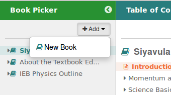
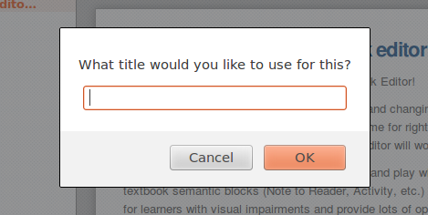
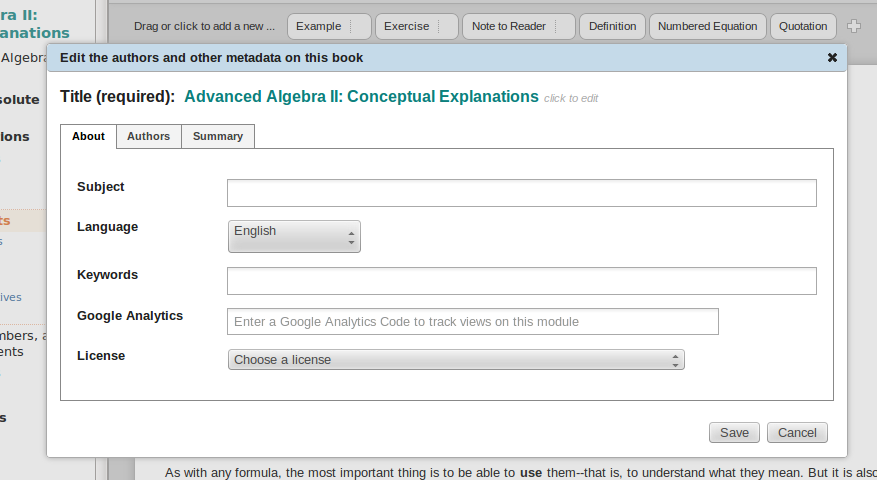

# Design: Add New Book with Metadata 

Design for adding basic metadata at the time a new book is created.

## Task List

- [ ] Change "OK" to "Next" on the title request

### Step 1. Add new book

### Step 2. Request title

Change "OK" to "Next" since we are going to request metadata before finishing.

### Step 3. Save book

Save <title>.opf, <title>-nav.html, <title>-module1.html

### Step 4. Request metadata

Mockup: 

This is the same metadata collection dialog that will come up from various other interactions, but it has a couple of variations from the mockup when it comes from "Create new book".

Variations
1. Instead of "Save", use "Next" and forward to the tab to the right.
2. On the right most tab, "Summary", say "Save".

Notes
1. The author can click on the tabs to move through them in addition to using the "Next" button. 
2. If the author cancels, no new metadata will be saved, but the book will still be created since that happens after the title is entered.

### Step 5.A Save metadata in the .opf file

